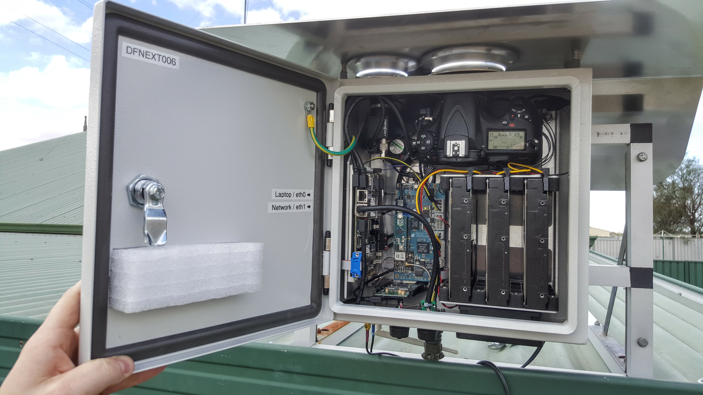
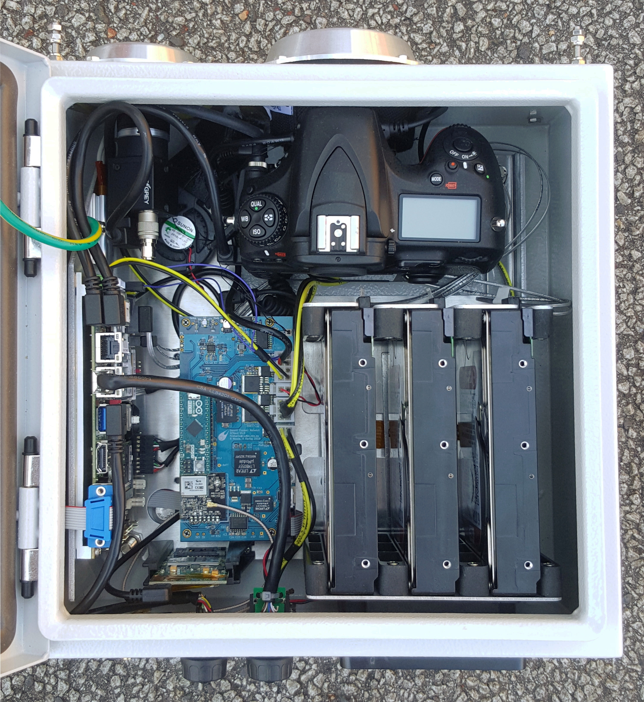
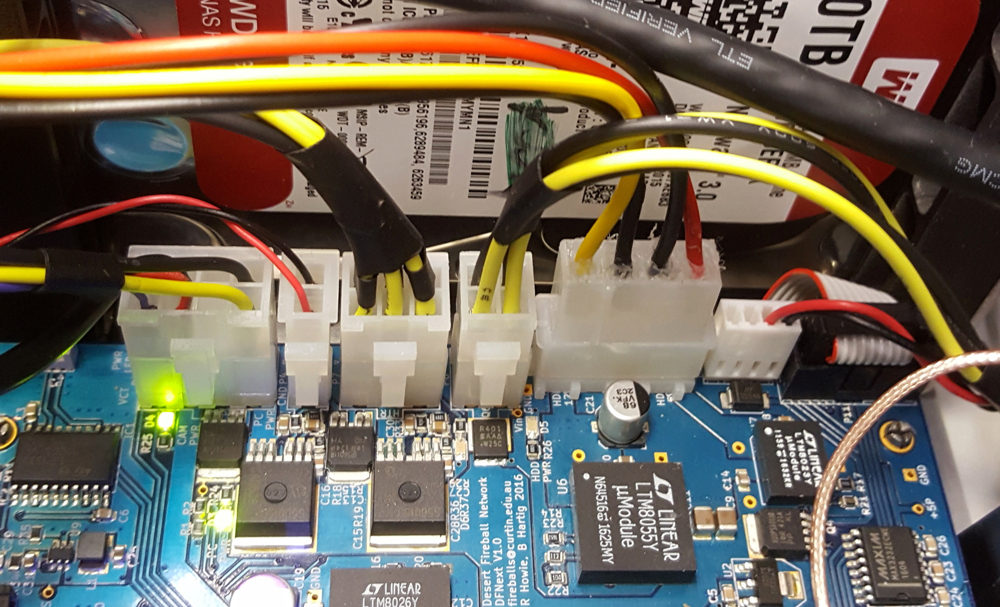
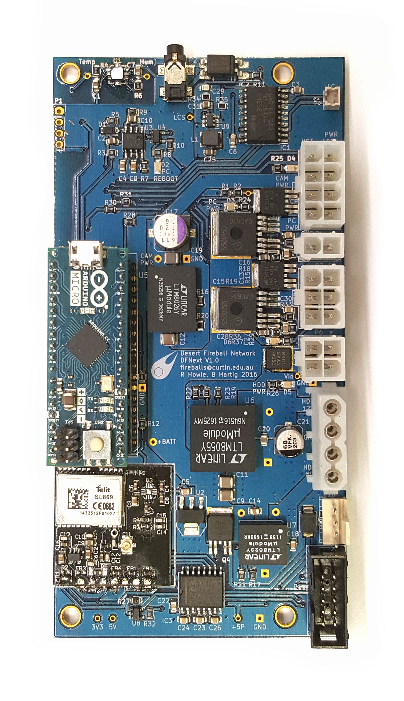

# DFNEXT

The DFNEXT fireball observatory is a revision of the DFN's digital
fireball observatory specifically created to facilitate the global
fireball observatory. It is the successor to the
[DFNSMALL](DFNSMALL.html) design. The primary objective of the
revision was to make maintenance easier for collaborators.

The first production run of EXT systems started in January 2017 and the
first deployed system was DFNEXT006 at Northam in March 2017.

It has a number of advantages over previous versions:

- Three 3.5 inch HDDs that **EXT**end the service interval up to 20
  months (using 10 TB drives)
- Digital video camera
- More powerful PC
- A revised internal layout to make changing drives significantly easier
- More durable crimped wire to board connectors aimed at improving
  reliability
- Simplified internal wiring made possible by moving more functionality
  onto the PCB
- A significantly more modular design that makes assembly and
  maintenance easier
- Quieter fan and the capability to add up to ≈200W of enclosure heating
- Digital temperature and humidity sensor, firmware based temperature
  regulation
- Weatherproof external Ethernet and USB connectors
- More durable and easier to manufacture outer blower duct
- More efficient switching regulators
- The LC shutter is driven at a regulated 18 V instead of unregulated 12
  V battery voltage to increases contrast between the open and closed
  states and make the closed state transmission consistent irrespective
  of battery voltage

*Internals_of_DFNEXT_installed_in_Northam.jpg*

*DFNEXT_Internals.jpg*

*Dfnext_connectors.jpg*

*DFNEXT_PCB.jpg*

## Assembly, deployment and maintenance

To assemble the remote observatory follow the instructions found in
[DFNEXT Assembly](DFNEXT_Assembly.html).

Here are instructions on [Mobile network - 3G/4G modem installation and
configuration](Mobile_network_-_3G,_4G.html).
